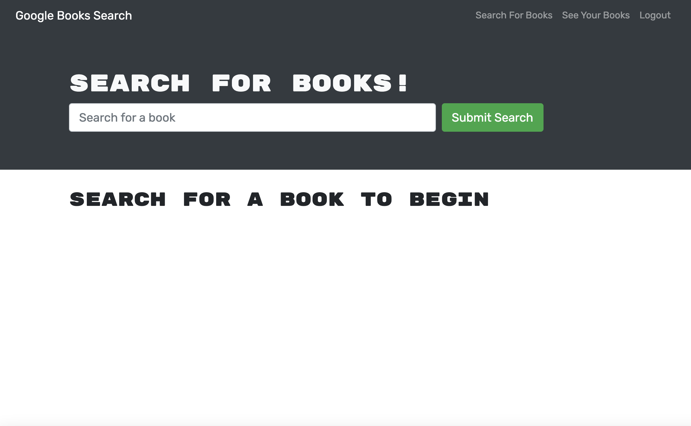
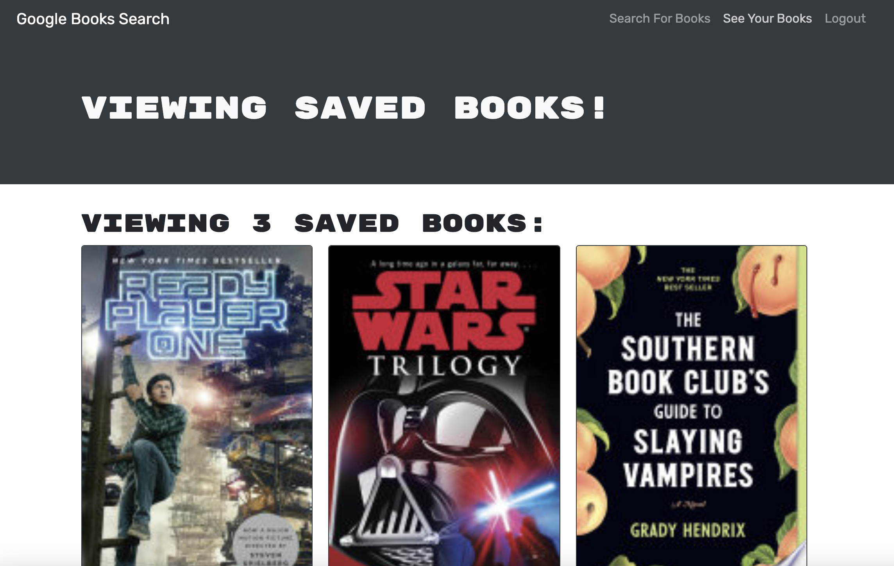

# Book Search Engine

 

## Description

The Book Search Engine application was built utilizing the MERN stack with [MongoDB](https://www.mongodb.com/), [Express](https://www.npmjs.com/package/express), [React](https://www.npmjs.com/package/create-react-app) and [Node.js](https://nodejs.org/en/). Using the [Google Books API](https://developers.google.com/books) the application uses [graphql](https://graphql.org/) and [Apollo Server](https://www.apollographql.com/docs/) instead of a RESTful API. The user can **Sign Up** or **Login** to add books to their profile. They also have the ability to view saved books and delete books. Once logged out, the user will need to log back in to view their profile.

## Table of Contents

- [About the Project](#about-the-project)
- [Installation](#installation)
- [Usage](#usage)
- [Contributing](#contributing)
- [Tests](#tests)
- [License](#license)
- [Questions](#questions)

## About the Project

- This project used code from a working RESTful API and converted it to [graphql](https://graphql.org/) using an [Apollo Server](https://www.apollographql.com/docs/).
- By reconfigering the **server** folder, the Apollo server was added and the **routes** and **controllers** provided were removed (since they are now handled through **graphql** and **Apollo**).
- In the **server** folder, a **schemas** folder was added to handle [graphql](https://graphql.org/) queries and mutations.
- The **server** and **package.json** files were also updated to add the [Apollo Server](https://www.apollographql.com/docs/) and dependicies.
- In the **client** folder, **queries.js** and **mutations.js** files were added to the **utils** folder to handle all [graphql](https://graphql.org/) requests.
- The **App.js** file was updated to include the **Apollo Provider** and **client** to all authorized routes.
- **Components** and **pages** were updated to include **Apollo** dependicies and query requests and mutations.
- Cleaned up **API.js** and removed all of the RESTful API code, left only the **serchGoogleBooks function**.
- Users can **Sign Up** or **Login** to save books to their profile.
- Once logged in, the user can delete any previously saved book.
- Once logged out, the user will have to log back in to save additional books, have access to books saved, or delete saved books.
- The **server** folder was built with the following technologies:

  - [Express](https://www.npmjs.com/package/express)
  - [apollo-express-server](https://www.npmjs.com/package/apollo-server-express)
  - [bcrypt](https://www.npmjs.com/package/bcrypt)
  - [jwt](https://www.npmjs.com/package/jwt)
  - [mongoose](https://www.npmjs.com/package/mongoose)
  - [MongoDB](https://www.mongodb.com/)
  - [Node.js](https://nodejs.org/en/)

- The **client** folder was built with the following technologies:

  - [React](https://www.npmjs.com/package/create-react-app)
  - [@apollo/client](https://www.npmjs.com/package/apollo-client)
  - [bootstrap](https://www.npmjs.com/package/bootstrap)
  - [graphql-tag](https://www.npmjs.com/package/graphql-tag)
  - [HTML](https://www.w3schools.com/html/), [CSS](https://www.w3.org/Style/CSS/Overview.en.html), and [Javascript](https://www.javascript.com/)
  - [Google Books API](https://developers.google.com/books)
  - [Node.js](https://nodejs.org/en/)

- For [Website Deployment](https://booksearchengine0821.herokuapp.com/) the following technologies were used:
  - [Heroku](https://heroku.com/)
  - [MongoDB Atlas](https://www.mongodb.com/)
  - [if-env](https://www.npmjs.com/package/if-env)

## Installation

Open [Book Search Engine GitHub Repository](https://github.com/twashke/Book-Search-Engine).

- Use the command line to **git clone**
- **npm install**
- **npm run develop** from command line to connect to server and client.
- Go to [localhost:3000](http://localhost:3000/) for client and [localhost:3001/graphql](http://localhost:3001/graphql) for the server while in development.

## Usage

- Go to [Deployed Book Search Engine Website](https://booksearchengine0821.herokuapp.com/)
- **Search for Books** using the input field.
- **Sign Up** to search and **Save Books** to profile.
- **Logout** once done.
- **Login** again to add, view or delete books from profile.

\
[Book Search Engine](https://booksearchengine0821.herokuapp.com/) Home Page \
\

\
**View Saved Books** after **Login** \
\

\
**Sign Up** as new user to search and add books \
\

\
**Login** to view, add books, and delete books \
\

## Contributing

- Starter code provided, linked to a RESTful API.
- Code was converted in both the **client** and **server** folder to utilize [graphql](https://graphql.org/) and an [Apollo Server](https://www.apollographql.com/docs/).

## Tests

- Testing done throughtout production on local host.
- Once deployed, tested again and fixed any issues.

## License

This application is covered by the [MIT License](https://opensource.org/licenses/MIT).

      Copyright 2021 Tiffany Washke

      Permission is hereby granted, free of charge, to any person obtaining a copy of this software and associated documentation files (the "Software"), to deal in the Software without restriction, including without limitation the rights to use, copy, modify, merge, publish, distribute, sublicense, and/or sell copies of the Software, and to permit persons to whom the Software is furnished to do so, subject to the following conditions:

      The above copyright notice and this permission notice shall be included in all copies or substantial portions of the Software.

      THE SOFTWARE IS PROVIDED "AS IS", WITHOUT WARRANTY OF ANY KIND, EXPRESS OR IMPLIED, INCLUDING BUT NOT LIMITED TO THE WARRANTIES OF MERCHANTABILITY, FITNESS FOR A PARTICULAR PURPOSE AND NONINFRINGEMENT. IN NO EVENT SHALL THE AUTHORS OR COPYRIGHT HOLDERS BE LIABLE FOR ANY CLAIM, DAMAGES OR OTHER LIABILITY, WHETHER IN AN ACTION OF CONTRACT, TORT OR OTHERWISE, ARISING FROM, OUT OF OR IN CONNECTION WITH THE SOFTWARE OR THE USE OR OTHER DEALINGS IN THE SOFTWARE.

## Questions

**Contact Tiffany Washke**

- **Email directly at** twashke@gmail.com
- **GitHub User Name:** [twashke](https://github.com/twashke)

